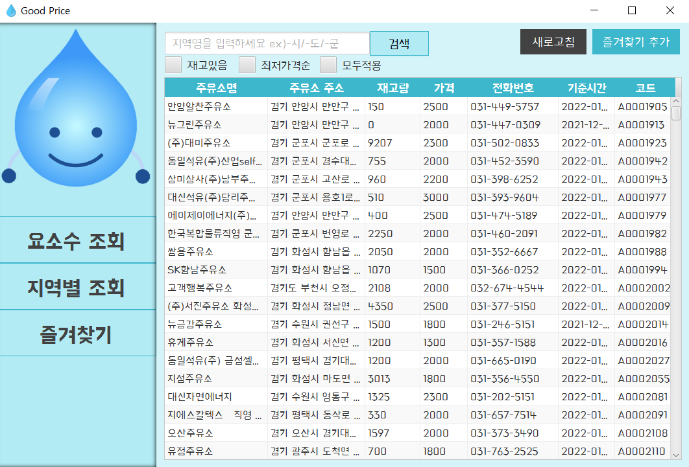

# GoodPrice

---
## Description

[실시간 주유소 재고](https://www.data.go.kr/data/15095040/openapi.do) 공공 API를 활용한 JavaFx+SceneBuilder 기반
<U>실시간 요소수 재고 검색 프로그램</U>


* **첫 실행화면**


* **메인 화면**


* **즐겨찾기 실행**


---

## Getting Started

DB Table 생성 후 실행 (`GoodPriceUrea.exe`: 실행파일 첨부)

```sql
create table urea_table(
addr VARCHAR2(100),
code VARCHAR2(100),
inventory VARCHAR2(100),
name VARCHAR2(100),
openTime VARCHAR2(100),
price VARCHAR2(100),
tel VARCHAR2(100),
regDt VARCHAR2(100)
);

create table favorite_table (
addr varchar2(50),
code varchar2(50),
inventory varchar2(50),
name varchar2(50),
openTime varchar2(50),
price varchar2(50),
tel varchar2(50),
regDt varchar2(50));
```